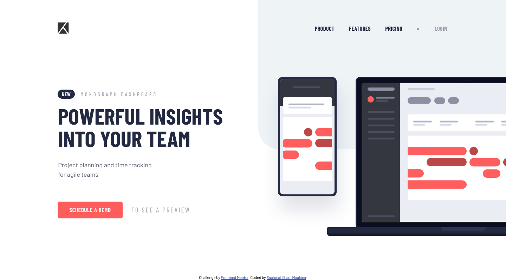

# Frontend Mentor - Project tracking intro component solution

This is a solution to the [Project tracking intro component challenge on Frontend Mentor](https://www.frontendmentor.io/challenges/project-tracking-intro-component-5d289097500fcb331a67d80e). Frontend Mentor challenges help you improve your coding skills by building realistic projects.

## Table of contents

- [Overview](#overview)
  - [The challenge](#the-challenge)
  - [Screenshot](#screenshot)
  - [Links](#links)
- [My process](#my-process)
  - [Built with](#built-with)
  - [What I learned](#what-i-learned)
  - [Continued development](#continued-development)
- [Author](#author)

## Overview

### The challenge

Users should be able to:

- View the optimal layout for the site depending on their device's screen size
- See hover states for all interactive elements on the page
- Create the background shape using code

### Screenshot

### Links

- Solution URL: [Solution page on Frontend Mentor]()
- Live Site URL: [Github Pages](https://rachmatilham.github.io/project-tracking-intro-component-master/)

## My process

### Built with

- Semantic HTML5 markup
- CSS custom properties
- Flexbox
- Mobile-first workflow

### What I learned

First time I made a page with a navigation dropdown menu, creating background with a code, and adjusting hero image to be optimal for different screen size.

### Continued development

I will continue to improve my skill on a responsive page so it should looks good on different screen size.

## Author

- Github - [Rachmat Ilham Maulana](https://github.com/rachmatilham)
- Frontend Mentor - [@rachmatilham](https://www.frontendmentor.io/profile/rachmatilham)
